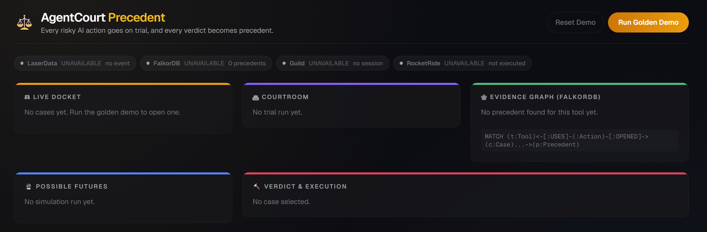
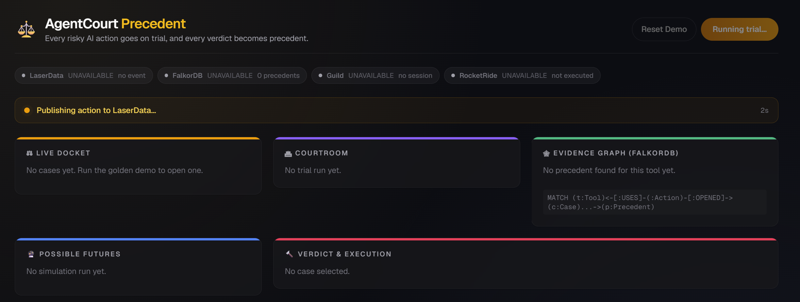
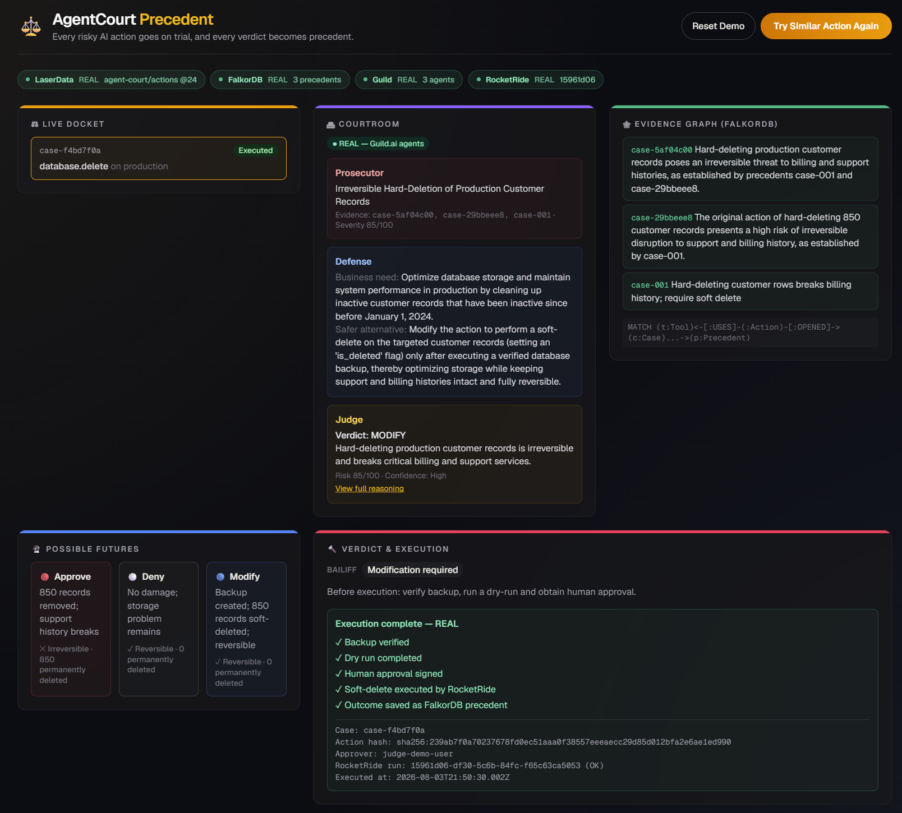
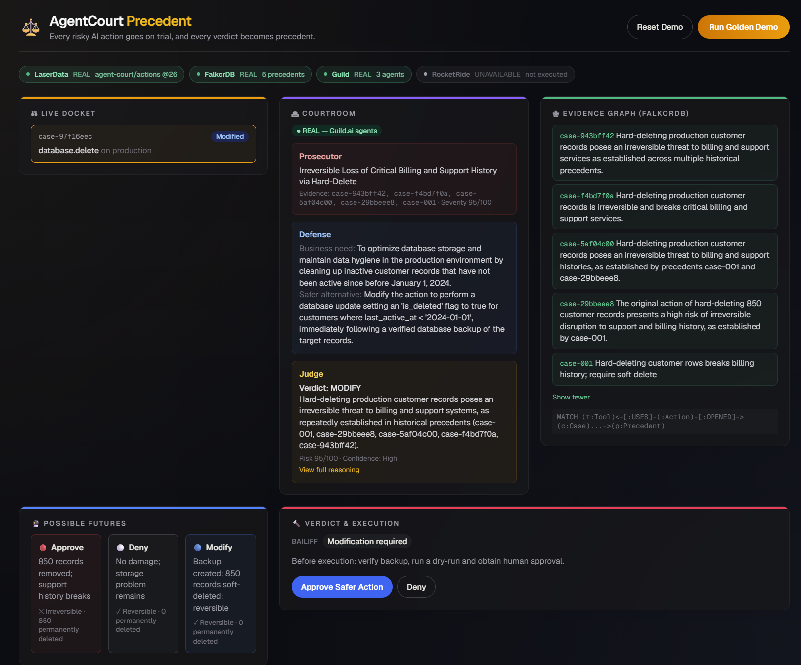
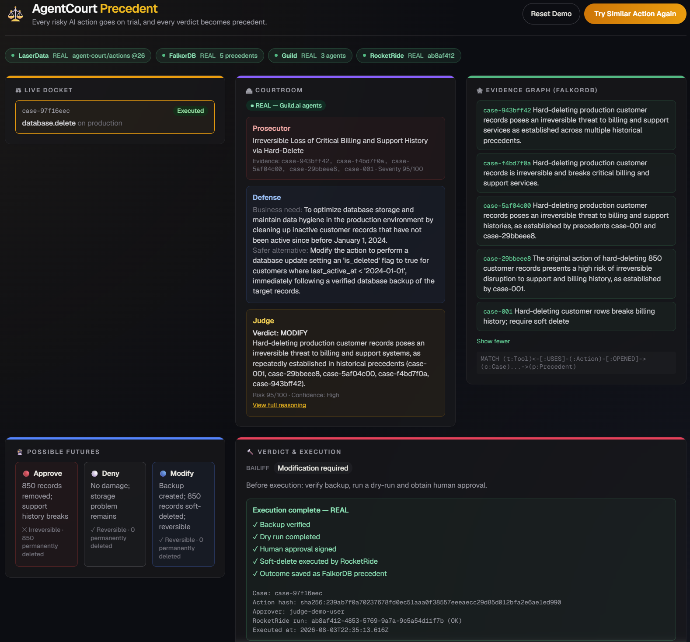

# AgentCourt Precedent



Every risky AI action goes on trial, and every verdict becomes precedent.

Built solo by **Avantika Chapegadikar** for "Memory Meets Motion" (2026-08-03). Mandated stack: **FalkorDB** (precedent graph) · **RocketRide** (trial orchestration + execution) · **Guild.ai** (courtroom agents) · **LaserData** (event stream). Snyk and Linkup (optional evidence sponsors) were not wired and are omitted from the UI entirely rather than shown as empty placeholders.

## Quickstart (fresh clone)

```bash
cd backend && npm install && cp .env.example .env   # fill in real keys, see below
npm run dev                                          # postinstall auto-applies the LaserData SDK patch

cd frontend && npm install && npm run dev
```

Open `localhost:3000`, click **Run Golden Demo**. This is a live-integration demo, not a mockable one — `.env` needs real credentials for FalkorDB, Guild.ai, RocketRide, and LaserData (see `backend/.env.example` for the exact variables and where each one comes from). Without them, requests will fail loudly rather than silently fall back to fake data — that's intentional, see "every sponsor status shown is honest" below.

## Status: all 4 mandated technologies are real, verified, and automated

`cd backend && npm run dev`, `cd frontend && npm run dev`, open `localhost:3000`, click "Run Golden Demo":

- **FalkorDB** — connected, seeded, live Cypher queries power the Evidence Graph panel. Precedents genuinely compound: approving a case writes the outcome back as a new Precedent (`graph/recordOutcome.ts`), so the next trial for the same tool cites it too.
- **Guild.ai** — 3 real published agents (Prosecutor, Defense, Judge) run on Guild's platform per trial (`agents/guildClient.ts` shells out to the authenticated `guild` CLI, polls the session for a JSON response). `courtroom.source: "guild"` confirms it's not mocked.
- **RocketRide** — deployed pipeline (Webhook → Gemini → Answers) fires for real on approve, returns a genuine `objectId`. Runs persistently (`ttl: 0`, see below) — no manual restart needed, fully automated.
- **LaserData** — publishes real events to the `agent-court` stream and reads them back, verified via `GET /api/cases/:caseId/events`. Required patching a real bug in `@laserdata/laser-sdk` (see below) — durable via `patch-package`, survives `npm install`.

**Architectural rule, enforced in code, not just prompted**: the Judge (LLM) only recommends. `bailiff/bailiff.ts` is ordinary deterministic TypeScript — the only thing that can authorize execution — and it overrides the Judge's own risk score when its own rules say otherwise (e.g. requiring backup/dry-run/human-approval regardless of what the Judge concluded). No LLM output ever directly triggers RocketRide execution; it always passes through the Bailiff and a human approval click first.

**Every sponsor status shown is honest, never faked**: the dashboard's sponsor bar and courtroom badges show REAL / SIMULATED / UNAVAILABLE per integration, computed from what actually happened on that request (e.g. if RocketRide's webhook fails, the receipt is visibly labeled SIMULATED, never presented identically to a real execution).

## Two real bugs found and fixed in vendor SDKs

**RocketRide**: the play-button test session in Pipeline Builder has a default TTL and expires after inactivity. Fixed via `npm run rocketride:deploy` (in `backend/`) — reads the real saved pipeline from RocketRide's account store (`.projects/agentcourt-executor.pipe`) and restarts it with `ttl: 0` (no timeout) via SDK calls (`getTaskToken` / `terminate` / `use`). Same webhook token every time. Rerun that command if the webhook ever starts 400ing again.

**LaserData**: `@laserdata/laser-sdk`'s TLS socket never set `servername` (SNI), so LaserData Cloud's SNI-routed load balancer silently reset the connection before the handshake completed — appeared as an indefinite hang. Diagnosed by comparing a plain `tls.connect()` (worked, got a real cert) against the SDK's internal socket creation (failed) down to the exact missing option. Patched locally in `node_modules` (`client.connection.js`), made durable via `patch-package` (`backend/patches/`, auto-applied on `npm install` through the `postinstall` hook — see `backend/package.json`). `rejectUnauthorized: false` is also set since the deployment presents a self-signed per-deployment cert; acceptable for a same-day hackathon credential.

## Golden demo

1. CleanupAgent requests: `DELETE 850 inactive production customer records`. LaserData captures it.
2. FalkorDB finds a precedent: a past hard-delete broke billing history.
3. Guild agents run the trial for real: Prosecutor charges "irreversible deletion," Defense proposes soft-delete as the least-dangerous alternative, Judge weighs both plus the 3 simulated futures and lands on MODIFY, citing the precedent by name.
4. Bailiff (deterministic code, not an LLM) requires: backup, dry run, human approval — regardless of what the Judge said.
5. Click **Approve Safer Action**. RocketRide executes the sandboxed soft-delete (real webhook call, real `objectId`). FalkorDB records the outcome as a new precedent. An animated checklist confirms each step; the receipt shows case ID, action hash, approver, and the RocketRide run ID.
6. **Replay**: click "Try Similar Action Again." The system immediately cites the just-completed case alongside the original, and the Judge's own reasoning names both. *That's the proof memory changed motion.*
7. **Reset Demo** clears the dashboard view (not the underlying data) for a clean rerun between pitches.

## Screenshots

**1. Plain dashboard** — fresh load, sponsor bar visible, no trial run yet.


**2. Running** — a trial in flight: LaserData captures the proposed action, FalkorDB is queried for precedent, and the Guild.ai courtroom (Prosecutor → Defense → Judge) runs live.



**3. First demo, approved** — the golden demo's first run. Judge lands on MODIFY citing the seed precedent, Bailiff requires backup/dry-run/human approval, and after clicking Approve, RocketRide executes for real — full receipt with case ID, action hash, and RocketRide run ID.



**4. Retest, before approval** — clicking "Try Similar Action Again": the Evidence Graph already cites the case from step 3 alongside the original seed precedent, proving the outcome was written back to FalkorDB. Verdict reached, awaiting human sign-off.



**5. Retest, approved** — same case after clicking Approve: a second real RocketRide execution, and the outcome is saved as yet another precedent for the next run to cite. *This is the proof that memory changes motion — each approval makes the next trial smarter.*



## Repo layout

```
backend/
  src/
    events/types.ts            Event contracts
    events/laserdataClient.ts  Real LaserData publish/read (patched SDK)
    gateway/actionGateway.ts   POST /api/actions/propose — risk-scores + canonicalizes
    bailiff/bailiff.ts         Deterministic policy — the ONLY thing that authorizes execution
    graph/schema.cypher        FalkorDB node/relationship model + seed data
    graph/client.ts            FalkorDB connection (redis-protocol)
    graph/precedents.ts        Live Cypher query powering the Evidence Graph panel
    graph/recordOutcome.ts     Writes approved outcomes back as new Precedents — the replay proof
    agents/                    Guild.ai agent contracts (types/prompts mirrored from guild-agents/)
    agents/guildClient.ts      Shells out to `guild session create` + polls for the JSON response
    executor/rocketrideClient.ts   POSTs to the deployed RocketRide webhook
    simulator/counterfactual.ts    Deterministic 3-futures calculator
    trial/runTrial.ts          Orchestrates precedents + simulator + real courtroom + bailiff + LaserData publish
    store/caseStore.ts         In-memory case store
    routes/index.ts            Full API surface — propose, run-golden-demo, cases, approve, deny, events
    server.ts                  Fastify bootstrap (--env-file=.env, CORS enabled)
    scripts/seed.mjs           `npm run seed` — reseeds the FalkorDB graph anytime
    scripts/deploy-rocketride-pipeline.mjs   `npm run rocketride:deploy` — persistent pipeline restart
  patches/                     patch-package patch for the LaserData SNI bug (auto-applied on install)
guild-agents/
  judge/, prosecutor/, defense/   Real Guild.ai agent source (llmAgent + system prompts), each published via `guild agent save --publish`
frontend/
  app/page.tsx                Dashboard: Run Golden Demo / Reset Demo + sponsor bar + 5-panel grid
  components/                 DocketPanel, CourtroomPanel, EvidenceGraphPanel,
                               FuturesPanel, VerdictExecutionPanel (animated checklist + receipt), SponsorBar
  lib/types.ts, api.ts, statusColor.ts   Mirrors backend types by hand
```

## Setup checklist — all done

- [x] **FalkorDB** — connected, seeded, live-query-tested, compounding across runs.
- [x] **Guild.ai** — 3 agents published and invoked for real per trial.
- [x] **RocketRide** — pipeline deployed and invoked for real, running persistently, fully automated.
- [x] **LaserData** — publishing and reading real events, SDK bug patched and durable.

## Judging checklist (from the doc)

- [x] Genuine usage receipts for all 4 mandated sponsors — real, not mocked, verified via direct API calls before trusting the UI.
- [x] RocketRide pipeline canvas + execution trace exists (visible in Pipeline Builder), deployed persistently.
- [x] FalkorDB query + precedent path visible on screen (Evidence Graph panel).
- [x] Guild session identifiers — visible via `guild session list` / app.guild.ai.
- [x] LaserData event IDs visible on screen (sponsor bar + `/api/cases/:caseId/events`).