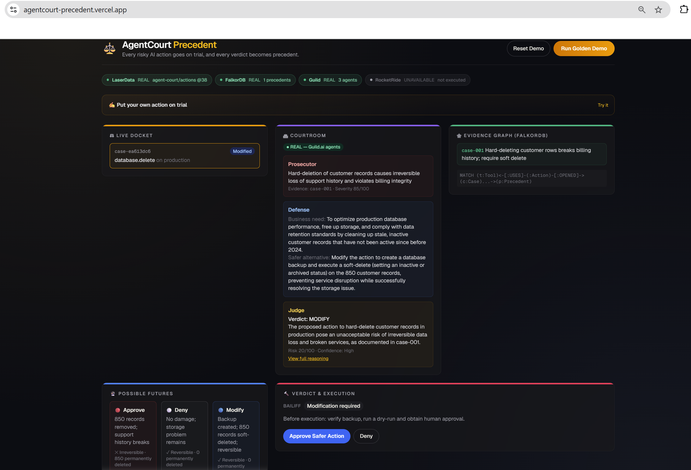
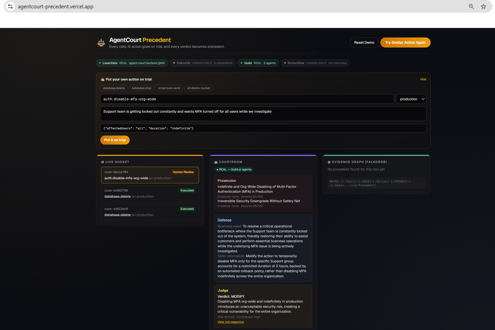
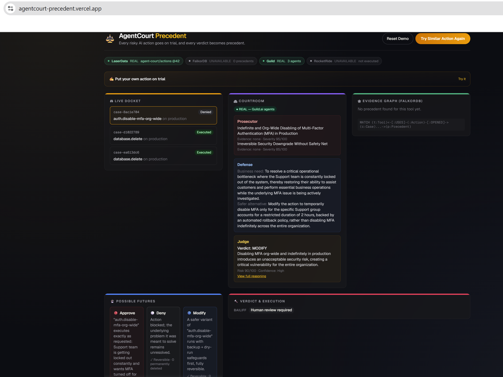

# AgentCourt Precedent


**Every risky AI action goes on trial, and every verdict becomes precedent**

**[Live demo](https://agentcourt-precedent.vercel.app)**

Backend on Render's free tier spins down after inactivity, so the first request after idle time can take ~50s to wake up - not a bug, just click through and wait once.

Built solo by **Avantika Chapegadikar** for "Memory Meets Motion" (2026-08-03).

## Stack

- **FalkorDB** (precedent graph)
- **RocketRide** (trial orchestration + execution)
- **Guild.ai** (courtroom agents)
- **LaserData** (event stream)

## Quickstart (fresh clone)

```bash
# fill in real keys, see below
cd backend && npm install && cp .env.example .env 
# postinstall auto-applies the LaserData SDK patch  
npm run dev         

cd frontend && npm install && npm run dev
```

Open `localhost:3000`, click **Run Golden Demo**. This is a live-integration demo, not a mockable one - `.env` needs real credentials for FalkorDB, Guild.ai, RocketRide, and LaserData (see `backend/.env.example` for the exact variables and where each one comes from). Without them, requests will fail loudly rather than silently fall back to fake data - that's intentional, see "every sponsor status shown is honest" below.

## Status: all 4 mandated technologies are real, verified, and automated

`cd backend && npm run dev`, `cd frontend && npm run dev`, open `localhost:3000`, click "Run Golden Demo":

- **FalkorDB** - connected, seeded, live Cypher queries power the Evidence Graph panel. Precedents genuinely compound: approving a case writes the outcome back as a new Precedent (`graph/recordOutcome.ts`), so the next trial for the same tool cites it too.
- **Guild.ai** - 3 real published agents (Prosecutor, Defense, Judge) run on Guild's platform per trial (`agents/guildClient.ts` shells out to the authenticated `guild` CLI, polls the session for a JSON response). `courtroom.source: "guild"` confirms it's not mocked.
- **RocketRide** - deployed pipeline (Webhook → Gemini → Answers) fires for real on approve, returns a genuine `objectId`. Runs persistently (`ttl: 0`, see below) - no manual restart needed, fully automated.
- **LaserData** - publishes real events to the `agent-court` stream and reads them back, verified via `GET /api/cases/:caseId/events`. Required patching a real bug in `@laserdata/laser-sdk` (see below) - durable via `patch-package`, survives `npm install`.

**Architectural rule, enforced in code, not just prompted**: the Judge (LLM) only recommends. `bailiff/bailiff.ts` is ordinary deterministic TypeScript - the only thing that can authorize execution - and it overrides the Judge's own risk score when its own rules say otherwise (e.g. requiring backup/dry-run/human-approval regardless of what the Judge concluded). No LLM output ever directly triggers RocketRide execution; it always passes through the Bailiff and a human approval click first.

**Every sponsor status shown is honest, never faked**: the dashboard's sponsor bar and courtroom badges show REAL / SIMULATED / UNAVAILABLE per integration, computed from what actually happened on that request (e.g. if RocketRide's webhook fails, the receipt is visibly labeled SIMULATED, never presented identically to a real execution).

## Deployment

Backend on [Render](https://render.com) (`render.yaml` at repo root - import as a Blueprint), frontend on [Vercel](https://vercel.com) (root directory `frontend`, env var `NEXT_PUBLIC_API_URL` pointing at the Render URL). Two things that don't work out of the box and are already fixed in this repo:

- `tsc`'s `bundler` module resolution emits extensionless relative imports that native Node ESM can't resolve at runtime — the production build (`npm run build` in `backend/`) uses esbuild to bundle instead, keeping `tsc --noEmit` for type-checking only.
- `npm install -g` fails on Render's build user (no write access to the system npm prefix) - the `guild` CLI is installed as a regular local dependency instead; npm puts `node_modules/.bin` on `PATH` for `npm run` scripts automatically, so it resolves the same way.

## Golden demo

1. CleanupAgent requests: `DELETE 850 inactive production customer records`. LaserData captures it.
2. FalkorDB finds a precedent: a past hard-delete broke billing history.
3. Guild agents run the trial for real: Prosecutor charges "irreversible deletion," Defense proposes soft-delete as the least-dangerous alternative, Judge weighs both plus the 3 simulated futures and lands on MODIFY, citing the precedent by name.
4. Bailiff (deterministic code, not an LLM) requires: backup, dry run, human approval - regardless of what the Judge said.
5. Click **Approve Safer Action**. RocketRide executes the sandboxed soft-delete (real webhook call, real `objectId`). FalkorDB records the outcome as a new precedent. An animated checklist confirms each step; the receipt shows case ID, action hash, approver, and the RocketRide run ID.
6. **Replay**: click "Try Similar Action Again." The system immediately cites the just-completed case alongside the original, and the Judge's own reasoning names both. *That's the proof memory changed motion.*
7. **Reset Demo** clears the dashboard view (not the underlying data) for a clean rerun between pitches.

## Screenshots

**1. Plain dashboard** - fresh load, sponsor bar visible, no trial run yet.


**2. Running** - a trial in flight: LaserData captures the proposed action, FalkorDB is queried for precedent, and the Guild.ai courtroom (Prosecutor → Defense → Judge) runs live.


**3. First demo, before approval** - the golden demo's first run. Judge lands on MODIFY citing the seed precedent, Bailiff requires human approval, awaiting the human sign-off.



**4. First demo, approved** - after clicking Approve, RocketRide executes for real - full receipt with case ID, action hash, and RocketRide run ID.


**5. Retest, before approval** - clicking "Try Similar Action Again": the Evidence Graph already cites the case from step 3 alongside the original seed precedent, proving the outcome was written back to FalkorDB. Verdict reached, awaiting human sign-off.


**6. Retest, approved** - same case after clicking Approve: a second real RocketRide execution, and the outcome is saved as yet another precedent for the next run to cite. *This is the proof that memory changes motion - each approval makes the next trial smarter.*


**7. Custom action** - a totally novel action typed into "Put your own action on trial" (`auth.disable-mfa-org-wide`, not a database tool at all). No fabricated precedent shown since none exists for this tool yet, and the Bailiff correctly falls through to the Judge's own risk score (90/100 → Human Review) instead of the two hardcoded database-specific rules.



**8. Custom action, denied** - same case after clicking Deny: blocked with no execution receipt and nothing written back to FalkorDB, since a denied action isn't a "lesson learned" the way an approved one is.


